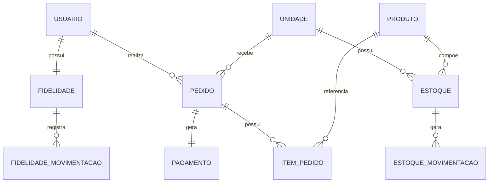
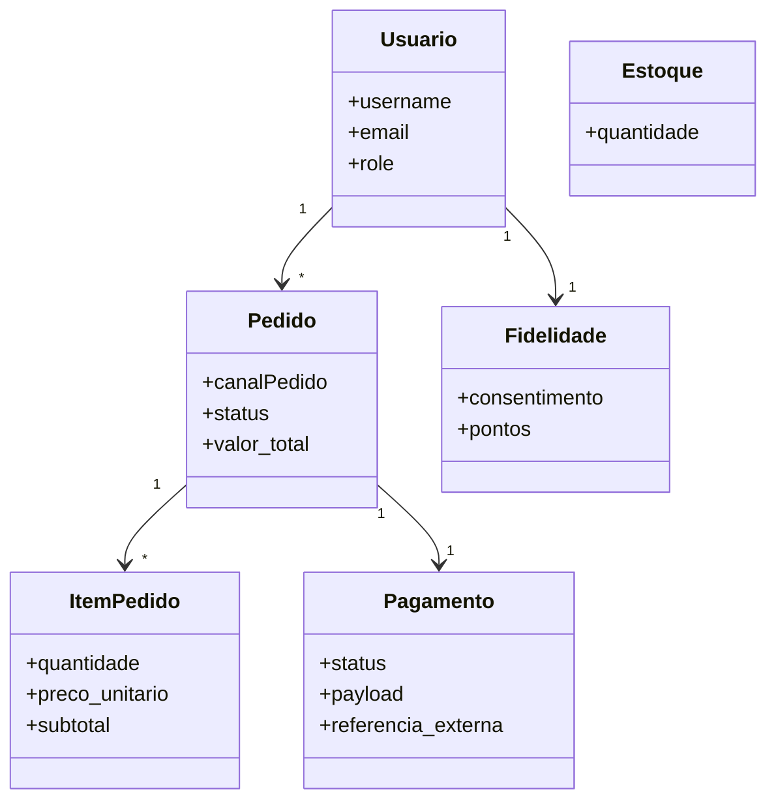
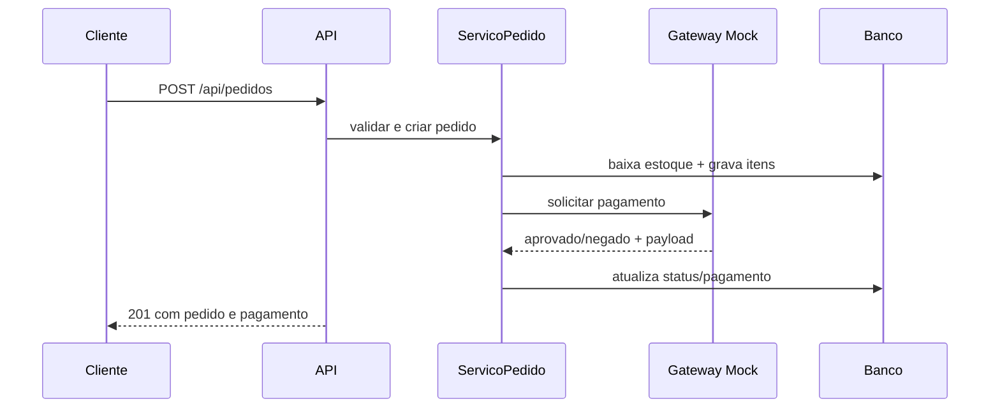

# Backend da Lanchonete

## Requisitos atendidos

- Cadastro e autenticacao com JWT e roles: `/api/auth/register/`, `/api/auth/token/`, `/api/auth/token/refresh/`
- Consulta de unidades e cardapio por unidade: `/api/unidades/`, `/api/unidades/{id}/cardapio/`
- Gestao de pedidos com canal de origem, itens, valor total, status e cancelamento
- Controle de estoque por unidade com movimentacoes
- Programa de fidelidade com consentimento, saldo, historico e resgate simples
- Pagamento mock externo com registro do payload de retorno
- Promocoes/campanhas com endpoint dedicado
- Erros padronizados e autenticacao baseada em token

## Casos de uso

### Atores

- Cliente
- Atendente
- Cozinha
- Gerente/Administrador
- Gateway de Pagamento Mock

### Fluxo critico: Realizar Pedido + Solicitar Pagamento

- Pre-condicoes:
  - usuario autenticado
  - unidade ativa
  - itens disponiveis em estoque
  - `canalPedido` informado
- Fluxo principal:
  - cliente envia pedido
  - sistema reserva/baixa estoque
  - sistema calcula total
  - sistema solicita pagamento ao mock externo
  - pagamento aprovado move pedido para `EM_PREPARO`
  - fidelidade credita pontos quando houver consentimento
- Excecoes:
  - estoque insuficiente: `409`
  - produto invalido/unidade invalida: `400`
  - pagamento negado: pedido cancelado com estorno
  - usuario sem autenticacao: `401`

## DER



## Arquitetura

- `core/models.py`: dominio e persistencia ORM
- `core/services.py`: casos de uso e regras de negocio
- `core/serializers.py`: contrato da API e validacoes de entrada/saida
- `core/views.py`: controllers/endpoints
- `core/permissions.py`: controle de acesso por role
- `core/exceptions.py`: padrao de erro

## Diagrama de classes



## Sequencia do fluxo critico



## Endpoints principais

### Auth

- `POST /api/auth/register/`
- `POST /api/auth/token/`
- `POST /api/auth/token/refresh/`

### Usuarios

- `GET /api/usuarios/me/`

### Unidades e cardapio

- `GET /api/unidades/`
- `GET /api/unidades/{id}/cardapio/`
- `GET|POST /api/produtos/`

### Estoque

- `GET /api/estoques/?unidadeId=1`
- `POST /api/estoques/movimentacoes/`

### Pedidos

- `GET /api/pedidos/?canalPedido=TOTEM&status=PRONTO`
- `POST /api/pedidos/`
- `GET /api/pedidos/{id}/`
- `PATCH /api/pedidos/{id}/status/`
- `POST /api/pedidos/{id}/cancelamento/`

### Pagamentos

- `GET /api/pagamentos/pedidos/{pedido_id}/`

### Fidelidade

- `GET /api/fidelidade/saldo/`
- `PATCH /api/fidelidade/saldo/`
- `GET /api/fidelidade/historico/`
- `POST /api/fidelidade/resgates/`

### Promocoes

- `GET /api/promocoes/`

## Padrao de erro

```json
{
  "error": {
    "code": "http_400",
    "message": "Erro no campo canalPedido.",
    "details": {
      "canalPedido": ["Este campo e obrigatorio."]
    }
  }
}
```
