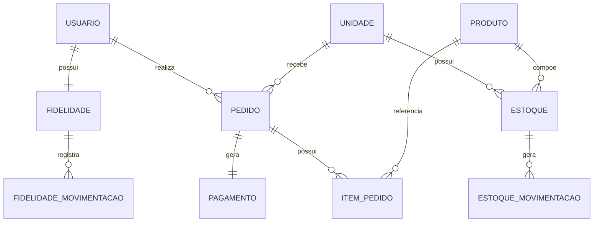
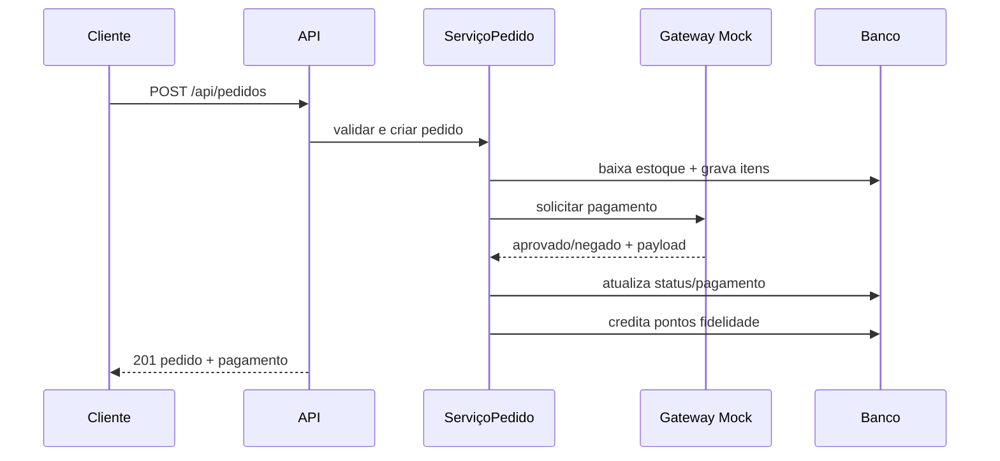
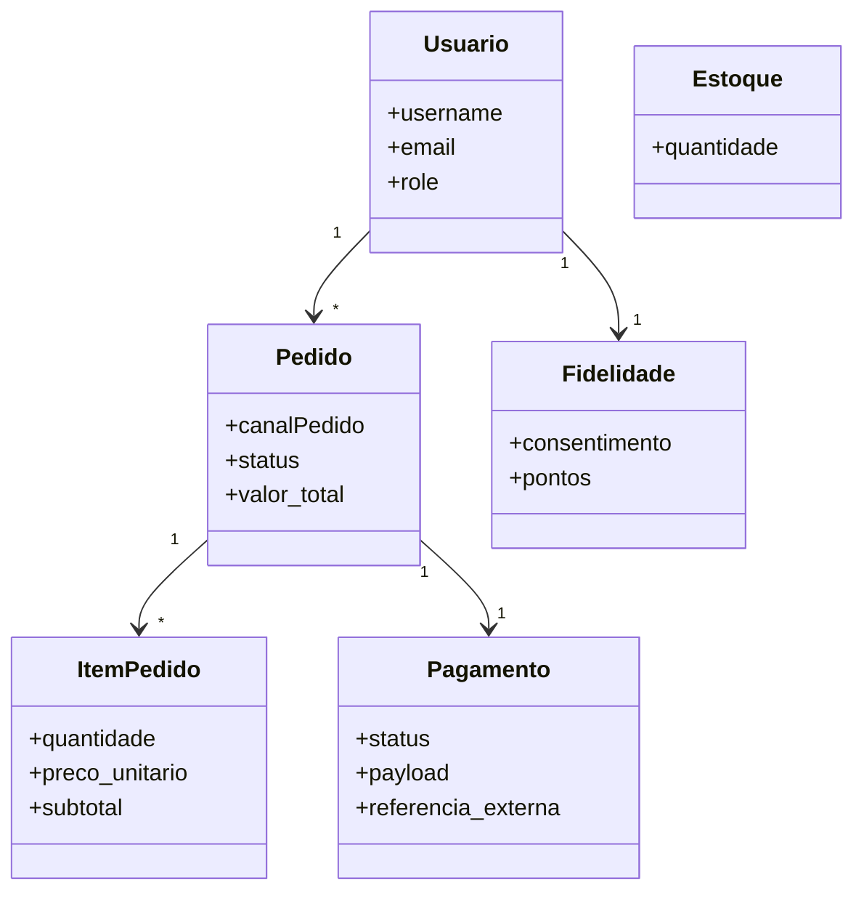

# Lanchonete API

> Backend completo com autenticação JWT por roles, gestão de pedidos multicanal, controle de estoque, programa de fidelidade e integração com gateway de pagamento mock.

**Stack:** Django REST · JWT Auth · Roles · Mock Payment · Estoque · Fidelidade · Promoções

---

## Atores do sistema

| Ator | Responsabilidade |
|------|-----------------|
| Cliente | Realiza pedidos |
| Atendente | Gerencia status dos pedidos |
| Cozinha | Prepara os pedidos |
| Gerente / Admin | Administração geral |
| Gateway Mock | Processa pagamentos |

---

## Fluxo crítico — Realizar pedido + Pagamento

### Pré-condições

- Usuário autenticado (token JWT válido)
- Unidade ativa e `canalPedido` informado
- Itens disponíveis em estoque

### Fluxo principal

1. Cliente envia `POST /api/pedidos/`
2. Sistema reserva / baixa estoque
3. Sistema calcula valor total
4. Sistema solicita pagamento ao mock externo
5. Pagamento aprovado → pedido move para `EM_PREPARO`
6. Fidelidade credita pontos (quando `consentimento = true`)

### Exceções

| Situação | Resposta |
|----------|----------|
| Estoque insuficiente | `409 Conflict` |
| Produto ou unidade inválida | `400 Bad Request` |
| Pagamento negado | Pedido cancelado + estorno de estoque |
| Usuário não autenticado | `401 Unauthorized` |

---

## Endpoints

### Auth

| Método | Rota | Descrição |
|--------|------|-----------|
| `POST` | `/api/auth/register/` | Cadastro de usuário |
| `POST` | `/api/auth/token/` | Login — obtém JWT |
| `POST` | `/api/auth/token/refresh/` | Renovar token |

### Usuários

| Método | Rota | Descrição |
|--------|------|-----------|
| `GET` | `/api/usuarios/me/` | Dados do usuário autenticado |

### Unidades & Cardápio

| Método | Rota | Descrição |
|--------|------|-----------|
| `GET` | `/api/unidades/` | Lista todas as unidades |
| `GET` | `/api/unidades/{id}/cardapio/` | Cardápio por unidade |
| `GET` | `/api/produtos/` | Lista produtos |
| `POST` | `/api/produtos/` | Criar produto |

### Pedidos

| Método | Rota | Descrição |
|--------|------|-----------|
| `GET` | `/api/pedidos/` | `?canalPedido=TOTEM&status=PRONTO` |
| `POST` | `/api/pedidos/` | Criar pedido |
| `GET` | `/api/pedidos/{id}/` | Detalhe do pedido |
| `PATCH` | `/api/pedidos/{id}/status/` | Atualizar status |
| `POST` | `/api/pedidos/{id}/cancelamento/` | Cancelar pedido + estorno |

### Estoque

| Método | Rota | Descrição |
|--------|------|-----------|
| `GET` | `/api/estoques/` | `?unidadeId=1` |
| `POST` | `/api/estoques/movimentacoes/` | Registrar movimentação |

### Fidelidade

| Método | Rota | Descrição |
|--------|------|-----------|
| `GET` | `/api/fidelidade/saldo/` | Saldo de pontos |
| `PATCH` | `/api/fidelidade/saldo/` | Atualizar consentimento |
| `GET` | `/api/fidelidade/historico/` | Extrato de pontos |
| `POST` | `/api/fidelidade/resgates/` | Resgatar pontos |

### Pagamentos

| Método | Rota | Descrição |
|--------|------|-----------|
| `GET` | `/api/pagamentos/pedidos/{pedido_id}/` | Status do pagamento |

### Promoções

| Método | Rota | Descrição |
|--------|------|-----------|
| `GET` | `/api/promocoes/` | Campanhas ativas |

---

## Arquitetura — Camadas

| Arquivo | Responsabilidade |
|---------|-----------------|
| `core/models.py` | Domínio e persistência ORM |
| `core/services.py` | Casos de uso e regras de negócio |
| `core/serializers.py` | Contrato da API e validações entrada/saída |
| `core/views.py` | Controllers e endpoints REST |
| `core/permissions.py` | Controle de acesso por role |
| `core/exceptions.py` | Padrão de erros da aplicação |

---

## Entidades — DER



### Campos principais

**USUARIO** — `username`, `email`, `role (enum)`

**PEDIDO** — `canalPedido (enum)`, `status (enum)`, `valor_total (decimal)`

**ITEM_PEDIDO** — `quantidade`, `preco_unitario`, `subtotal`

**PAGAMENTO** — `status (enum)`, `payload (json)`, `referencia_externa`

**ESTOQUE** — `quantidade`, `unidade_fk`, `produto_fk`

**FIDELIDADE** — `consentimento (bool)`, `pontos`, `usuario_fk`

---

## Diagrama de sequência



---

## Diagrama de classes



---

## Padrão de erro

Todos os erros seguem o mesmo contrato:

```json
{
  "error": {
    "code": "http_400",
    "message": "Erro no campo canalPedido.",
    "details": {
      "canalPedido": ["Este campo é obrigatório."]
    }
  }
}
```

### Códigos HTTP utilizados

| Código | Significado |
|--------|-------------|
| `200` | OK |
| `201` | Created |
| `400` | Bad Request |
| `401` | Unauthorized |
| `403` | Forbidden |
| `404` | Not Found |
| `409` | Conflict (estoque insuficiente) |
| `500` | Internal Server Error |
